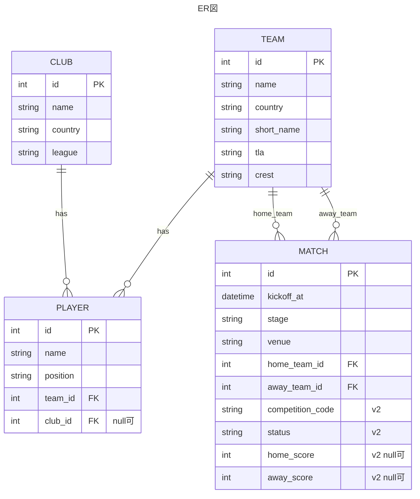

## DB設計

作成者: shinkai23

### DBの概要
DBはSQLiteを使用し、Python側のDB操作にはSQLAlchemyを使用する。
試合は大会ごとに DB を分けず、`matches` テーブルに集約し、`competition_code` で区別する（v2）。

### データ関係図

カラムの詳細・sync 方針は `docs/モデル・スキーマ設計.md` を参照する。

### MATCHについて
v1 では W杯の試合日程を中心に扱う。v2 で `competition_code`・`status`・スコアを追加する。
選手・クラブ機能では、Match が参照する Team を起点に Player / Club を表示する想定（v1 未実装）。

### Team ID の扱い
v1 では、football-data.org のチームIDを `teams.id` として利用する。
外部APIを football-data.org に固定することで、別途 `external_id` は持たず、同期処理を単純化する。
将来的に複数APIを扱う場合は、 `external_id` や `source` カラムの追加を検討する。
