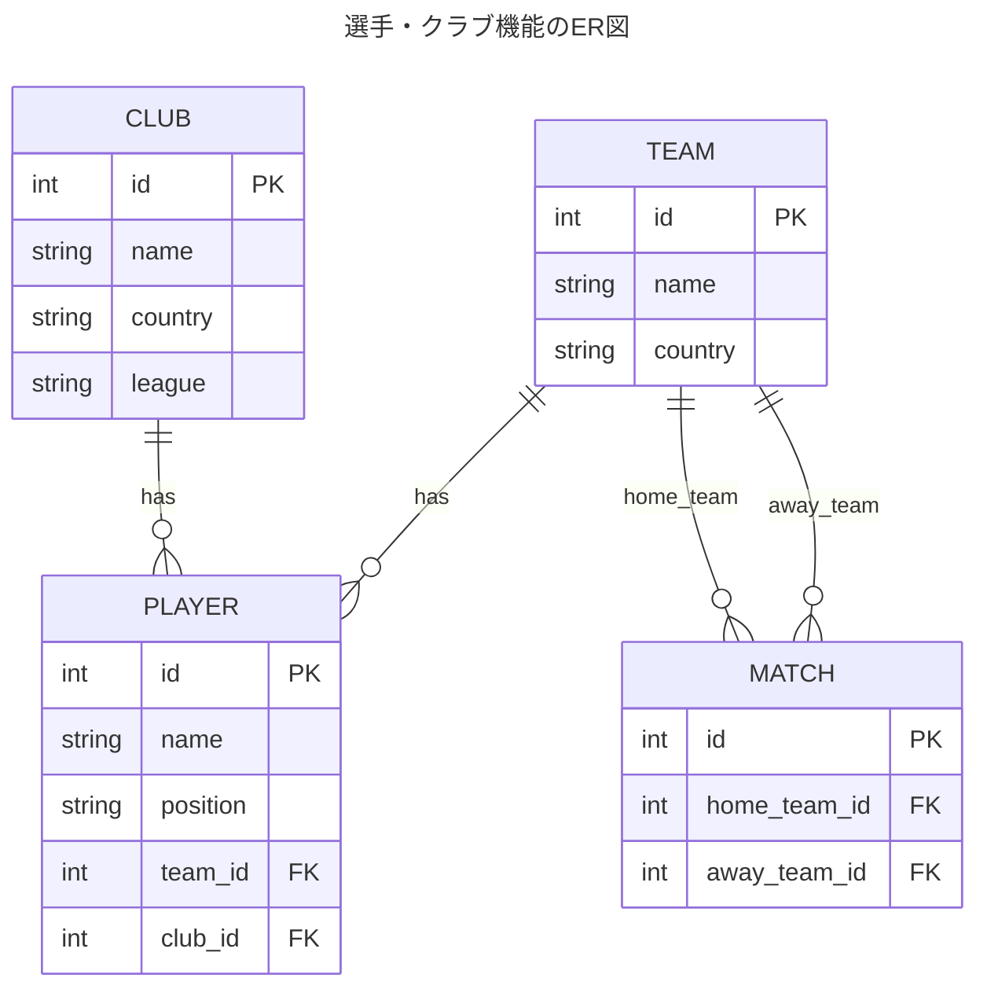

## 選手・クラブ機能のDB設計

作成者: shinkai23

### DBの概要
DBはSQLiteを使用し、Python側のDB操作にはSQLAlchemyを使用する。

### データ関係図

### MATCHについて
Match は試合日程機能側の責務であるため、本設計では詳細なカラム定義は扱わない。
選手・クラブ機能では、Match が参照する Team を起点に Player / Club を表示する。